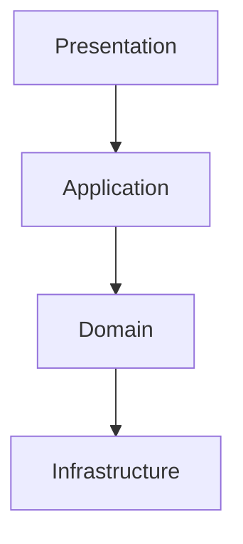
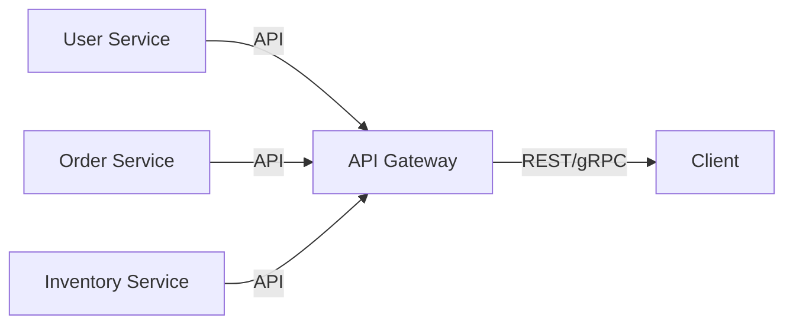
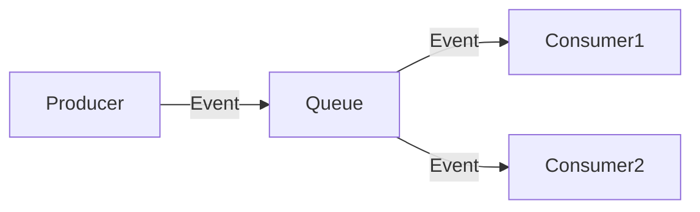
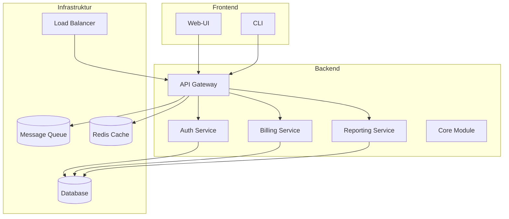

# Enterprise-Architektur

Diese Seite beschreibt Architektur-Patterns, Skalierungsstrategien und Best Practices für große HypnoScript-Projekte in Unternehmen.

## Architektur-Patterns

### Schichtenarchitektur (Layered Architecture)

- **Presentation Layer**: CLI, Web-UI, API-Gateways
- **Application Layer**: Geschäftslogik, Orchestrierung
- **Domain Layer**: Kernlogik, Validierung, Regeln
- **Infrastructure Layer**: Datenbank, Messaging, externe Services



### Microservices-Architektur

- Services sind unabhängig, kommunizieren über APIs/Events
- Jeder Service kann eigene HypnoScript-Module nutzen
- Service Discovery, Load Balancing, API-Gateways



### Event-Driven Architecture

- Lose Kopplung durch Events und Message Queues
- Skalierbare, asynchrone Verarbeitung



## Modularisierung

- Trennung in eigenständige Module (z.B. auth, billing, reporting)
- Gemeinsame Utility- und Core-Module
- Klare Schnittstellen (APIs, Contracts)

```bash
project/
├── modules/
│   ├── auth/
│   ├── billing/
│   ├── reporting/
│   └── core/
├── shared/
│   └── utils.hyp
├── config/
│   └── hypnoscript.config.json
└── scripts/
    └── deploy.sh
```

## Skalierung und Deployment

### Skalierungsstrategien

- **Horizontal Scaling**: Mehrere Instanzen, Load Balancer
- **Vertical Scaling**: Mehr Ressourcen pro Instanz
- **Auto-Scaling**: Dynamische Anpassung je nach Last

### Deployment-Patterns

- **Blue-Green Deployment**: Zwei Umgebungen, Umschalten ohne Downtime
- **Canary Releases**: Neue Version für Teilmenge der Nutzer
- **Rolling Updates**: Schrittweise Aktualisierung

### Containerisierung

- Nutzung von Docker für reproduzierbare Deployments
- Orchestrierung mit Kubernetes, Docker Swarm

```yaml
# Beispiel: Kubernetes Deployment
apiVersion: apps/v1
kind: Deployment
metadata:
  name: hypnoscript-app
spec:
  replicas: 3
  selector:
    matchLabels:
      app: hypnoscript
  template:
    metadata:
      labels:
        app: hypnoscript
    spec:
      containers:
        - name: hypnoscript
          image: myregistry/hypnoscript:latest
          ports:
            - containerPort: 8080
```

## Observability & Monitoring

- Zentrales Logging (ELK, Grafana, Prometheus)
- Distributed Tracing (OpenTelemetry, Jaeger)
- Health Checks, Alerting

## Security & Compliance

- Zentrale Authentifizierung (SSO, OAuth, LDAP)
- Verschlüsselung (TLS, At-Rest, In-Transit)
- Audit-Logging, GDPR/DSGVO-Compliance

## Best Practices

- **Konfigurationsmanagement**: Trennung von Code und Konfiguration
- **Automatisierte Tests & CI/CD**: Qualität und Sicherheit
- **Infrastructure as Code**: Terraform, Ansible, Helm
- **Dokumentation & Wissensmanagement**: Zentral gepflegte Doku

## Beispiel-Architekturdiagramm



## Nächste Schritte

- [Enterprise-Sicherheit](./security) – Sicherheitsarchitektur
- [Enterprise-Monitoring](./monitoring) – Monitoring & Alerting
- [Enterprise-Integration](./integration) – Schnittstellen & Integration

---

**Architektur gemeistert? Dann lerne [Enterprise-Sicherheit](./security) kennen!** 🏛️
