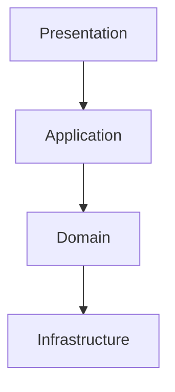
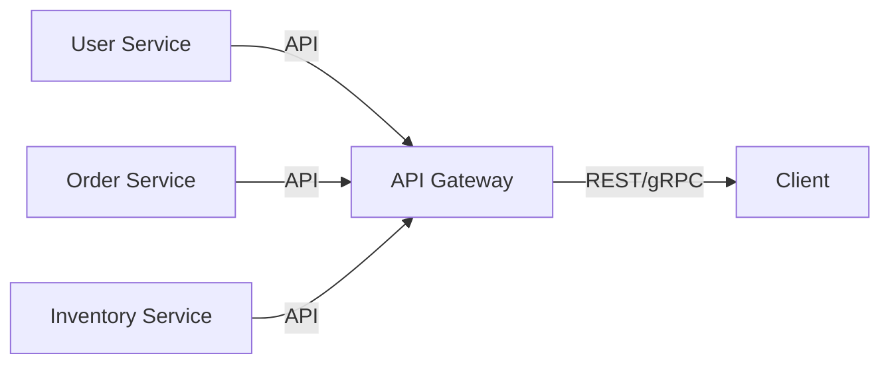
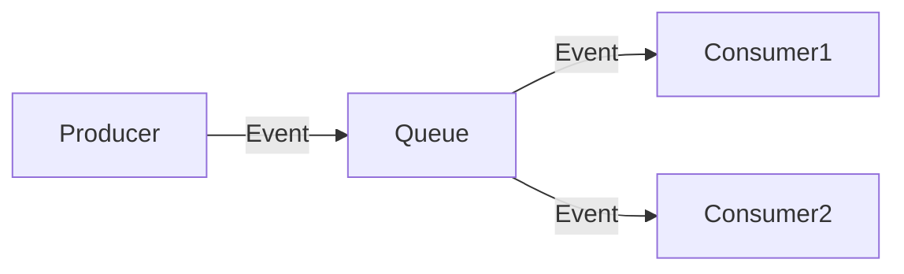
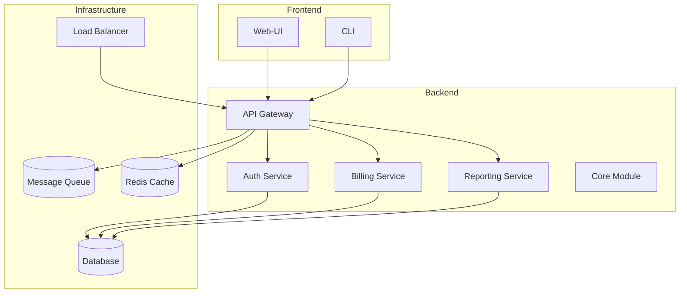

# Runtime Architecture

This page describes architecture patterns, scaling strategies, and best practices for large HypnoScript projects in enterprises.

## Architecture Patterns

### Layered Architecture

- **Presentation Layer**: CLI, Web-UI, API Gateways
- **Application Layer**: Business logic, orchestration
- **Domain Layer**: Core logic, validation, rules
- **Infrastructure Layer**: Database, messaging, external services



### Microservices Architecture

- Services are independent, communicate via APIs/Events
- Each service can use its own HypnoScript modules
- Service Discovery, Load Balancing, API Gateways



### Event-Driven Architecture

- Loose coupling through events and message queues
- Scalable, asynchronous processing



## Modularization

- Separation into standalone modules (e.g., auth, billing, reporting)
- Shared utility and core modules
- Clear interfaces (APIs, Contracts)

```bash
project/
├── modules/
│   ├── auth/
│   ├── billing/
│   ├── reporting/
│   └── core/
├── shared/
│   └── utils.hyp
├── config/
│   └── hypnoscript.config.json
└── scripts/
    └── deploy.sh
```

## Scaling and Deployment

### Scaling Strategies

- **Horizontal Scaling**: Multiple instances, load balancer
- **Vertical Scaling**: More resources per instance
- **Auto-Scaling**: Dynamic adjustment based on load

### Deployment Patterns

- **Blue-Green Deployment**: Two environments, switch without downtime
- **Canary Releases**: New version for subset of users
- **Rolling Updates**: Gradual update

### Containerization

- Using Docker for reproducible deployments
- Orchestration with Kubernetes, Docker Swarm

```yaml
# Example: Kubernetes Deployment
apiVersion: apps/v1
kind: Deployment
metadata:
  name: hypnoscript-app
spec:
  replicas: 3
  selector:
    matchLabels:
      app: hypnoscript
  template:
    metadata:
      labels:
        app: hypnoscript
    spec:
      containers:
        - name: hypnoscript
          image: myregistry/hypnoscript:latest
          ports:
            - containerPort: 8080
```

## Observability & Monitoring

- Centralized logging (ELK, Grafana, Prometheus)
- Distributed tracing (OpenTelemetry, Jaeger)
- Health checks, alerting

## Security & Compliance

- Centralized authentication (SSO, OAuth, LDAP)
- Encryption (TLS, at-rest, in-transit)
- Audit logging, GDPR compliance

## Best Practices

- **Configuration Management**: Separation of code and configuration
- **Automated Testing & CI/CD**: Quality and security
- **Infrastructure as Code**: Terraform, Ansible, Helm
- **Documentation & Knowledge Management**: Centrally maintained documentation

## Example Architecture Diagram



## Next Steps

- [Runtime Security](./security) – Security architecture
- [Runtime Monitoring](./monitoring) – Monitoring & Alerting
- [Runtime Integration](./integration) – Interfaces & Integration

---

**Mastered architecture? Then learn about [Runtime Security](./security)!** 🏛️
